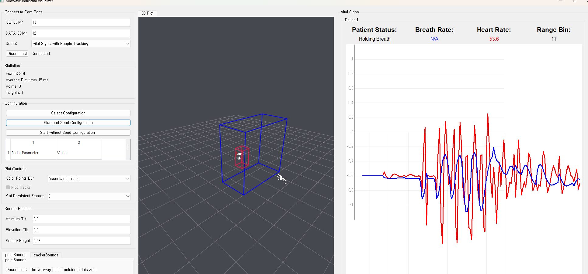
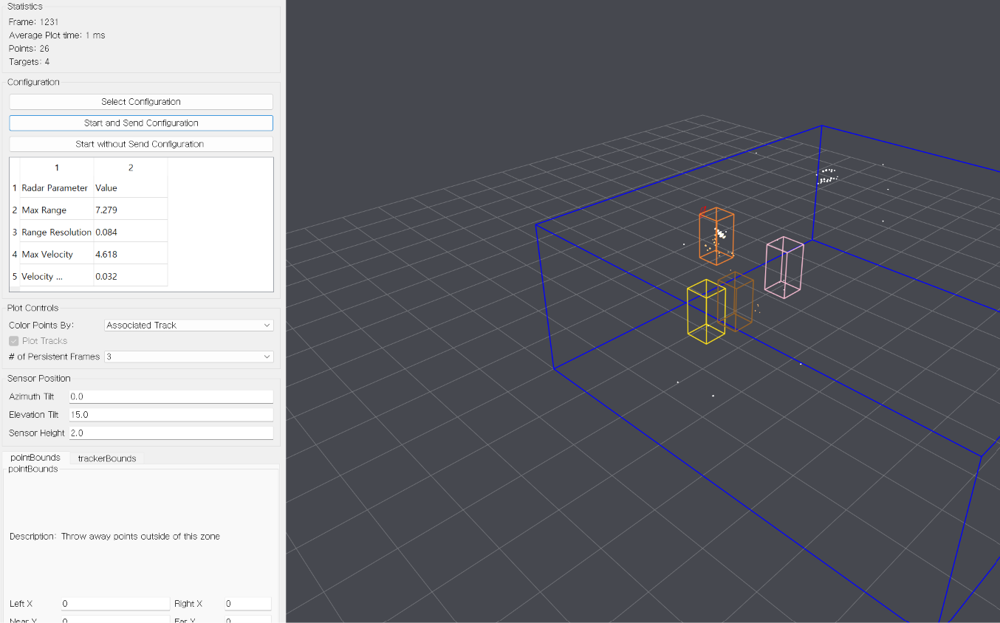

# mmWave demo

TI IWR6843AOPEVM에서 3D People Counting과 Vital Signs with People Tracking을 실행한 기록 및 Industrial Visualizer 수정 코드입니다. 기준 배포본은 **Radar Toolbox 1.00.00.26**, 보드는 **IWR6843AOP ES2.0**, SDK는 **3.5.0.4**입니다.

## 실행 화면

아래는 실제 보드 실험 중 사용자가 제공한 UI 캡처입니다. 최종 코드 수정 후 새로 촬영한 검증 화면은 아닙니다.

### Vital Signs with People Tracking



분홍색 상자는 추적 대상, 흰 점은 점군입니다. Breath Rate와 Heart Rate는 데모 추정값입니다. `Holding Breath`는 호흡 파형 변화가 임계값보다 작다는 GUI 판정이며 실제 무호흡을 확정하지 않습니다.

### 3D People Counting



## 설치와 실행

Windows에서 Python 3.11과 아래 의존성 조합으로 실행했습니다.

```powershell
py -3.11 -m venv .venv
.\.venv\Scripts\python.exe -m pip install -r requirements.txt
.\Start-Visualizer.cmd
```

1. Demo에서 펌웨어에 맞는 항목을 선택합니다. 메뉴 변경만으로 보드 펌웨어가 바뀌지는 않습니다.
2. CLI COM과 DATA COM에는 **숫자만** 입력합니다. 실험 PC에서는 각각 `13`, `12`였습니다. 다른 PC에서는 장치 관리자에서 확인합니다.
3. Connect 후 Select Configuration으로 해당 `.cfg`를 읽습니다.
4. 보드를 재시작했으면 **Start and Send Configuration**을 선택합니다.
5. 보드가 같은 설정으로 계속 실행 중이고 GUI만 다시 열었다면 **Start without Send Configuration**을 선택합니다. 이때도 GUI에서 설정 파일을 먼저 읽어야 합니다.

CLI는 115200 baud, DATA는 921600 baud입니다. 다른 Visualizer나 UniFlash가 같은 포트를 열고 있으면 연결할 수 없습니다.

## 펌웨어

바이너리와 SDK, 설치 실행 파일은 저장소에 포함하지 않습니다. TI 공식 배포본에서 받습니다.

- [Radar Toolbox](https://www.ti.com/tool/RADAR-TOOLBOX)
- [UniFlash](https://www.ti.com/tool/UNIFLASH)
- [IWR6843AOPEVM](https://www.ti.com/tool/IWR6843AOPEVM)

Radar Toolbox 1.00.00.26 내부 경로:

| 데모 | 펌웨어 |
|---|---|
| 3D People Counting | `source/ti/examples/People_Counting/3D_People_Counting/prebuilt_binaries/3D_people_count_68xx_demo.bin` |
| Vital Signs | `source/ti/examples/Medical/Vital_Signs_With_People_Tracking/prebuilt_binaries/vital_signs_tracking_6843AOP_demo.bin` |

실험 보드에서는 전원을 분리한 후 S3 ON으로 플래싱 모드를 설정하고, UniFlash의 `IWR6843AOP`, CLI COM 포트, Meta Image 1을 사용했습니다. 성공 메시지 후 전원을 분리하고 S3 OFF로 복구한 뒤 재연결합니다. 보드 리비전에 따라 스위치 배치가 다를 수 있으므로 해당 EVM 가이드를 확인합니다. 플래싱은 기존 펌웨어를 교체합니다.

## 실험 설정

`configs/vital_signs_AOP_2m_height095_horizontal.cfg`는 공식 AOP 2m 설정의 `sensorPosition`을 `0.95 0 0`으로 변경한 것입니다.

- 바닥에서 센서까지 95cm: 책상 75cm + 받침 20cm
- 수평 설치, 가슴 방향으로 배치
- 추적 대상 최대 1명, 전방 추적 경계 0.5~2m
- 앉아서 자연스럽게 호흡하며 최소 20~30초 정지한 후 관찰
- 이 프로파일에서 Range Bin 한 칸은 약 8.4cm: 11은 약 0.92m의 분석 구간

`AOP_6m_default.cfg`는 별도의 People Counting 펌웨어용입니다. 두 데모의 설정 파일을 혼용하지 않습니다. 설치 높이와 각도는 실제 환경에 맞춰 조정해야 합니다.

## 수정 내용

- UART를 지속 버퍼로 읽어 타임아웃·부분 수신 중 프레임을 보존합니다.
- 헤더 및 TLV 길이를 검증하고 손상된 프레임에서 다음 매직 워드로 재동기화합니다.
- UART 작업 스레드 중복 시작을 방지합니다.
- Vital Signs 설정이 없으면 시작을 차단해 `maxTracks` 오류를 방지합니다.
- OpenGL 항목 갱신을 GUI 스레드에서 수행해 위치·색·크기 배열 갱신과 렌더링의 경쟁을 피합니다.
- 색상 범위를 벗어난 추적 ID는 미연결 점으로 표시합니다.
- 누락된 프레임을 이전 점군과 잘못 연결하지 않도록 처리합니다.

## 검증 및 한계

실험 중 원본 UART 89프레임을 정상 해석했습니다. 손상 TLV 삽입 후 다음 프레임 복구, GUI에 프레임 누락·잘못된 추적 ID를 주입한 재생, 점 위치·색·크기 배열 길이 일치, 설정 누락 시작 차단을 로컬에서 확인했습니다. 기존 People Counting 캡처 36프레임/높이 레코드 108개도 파서 오류 없이 확인했습니다.

최종 OpenGL 수정 후 하드웨어 장시간 실행은 아직 검증하지 않았습니다. 패킷 손실의 근본 원인이 해결됐다고 단정하지 않습니다. 신호 정확도 및 임상 성능을 검증한 프로젝트가 아닙니다.

## 문제 해결

| 증상 | 확인 사항 |
|---|---|
| Unable to Connect | COM 접두어를 빼고 숫자만 입력, 다른 프로그램의 포트 점유 확인 |
| Frame 0 | 보드 재시작 여부 확인. 재시작했다면 설정 전송 필요 |
| maxTracks 오류 | Select Configuration에서 해당 파일을 먼저 읽기 |
| TLV 오류/점 개수 불일치 | 최신 수정 코드 사용, 반복되면 원본 UART와 프레임 누락 확인 |
| OpenGL broadcast 오류 | 최신 코드 적용 후 GUI 재실행 |

## 출처

`src/`는 TI Radar Toolbox 1.00.00.26의 `tools/visualizers/Industrial_Visualizer` Python 소스를 바탕으로 수정했습니다. 설정 파일도 같은 배포본에서 유래합니다. TI 원본의 권리는 원저작자에게 있으며 이 저장소는 원본에 대해 새로운 라이선스를 부여하지 않습니다. 사용·재배포 시 TI 배포본의 라이선스를 확인하세요. TI 공식 프로젝트가 아닙니다.
